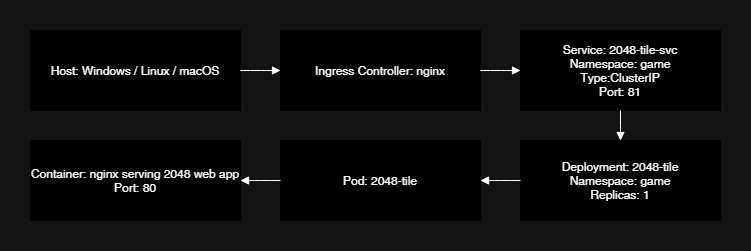

2048 Game Deployment
---
This repository contains a containerized version of the classic **2048 web game**, deployed on a local Kubernetes cluster using **Kind** (Kubernetes in Docker). The goal is to make the game accessible in a browser at [http://2048.local](http://2048.local).

You can set it up either **manually step-by-step** or **automatically with a single script command**.  
I chose to use scripts instead of Ansible to keep the setup **simple, lightweight, and dependency-free**.

---

## Table of Contents

- [Prerequisites](#prerequisites)
- [Topology](#topology)
- [Setup Instructions](#setup-instructions)
  - [Manual Setup](#manual-setup)
  - [Automated Setup (Script)](#automated-setup-(script))
- [Accessing the Game](#accessing-the-game)
- [Troubleshooting](#troubleshooting)

---

## Prerequisites

Ensure the following tools are installed on your local machine:

- [Docker](https://www.docker.com/get-started) (min version 20.10.x)  
- [Kind](https://kind.sigs.k8s.io/) (min version 0.20.x)  
- [kubectl](https://kubernetes.io/docs/tasks/tools/) (min version 1.26.x)  
- [Git](https://git-scm.com/) (min version 2.30.x)  
- [VSCode](https://code.visualstudio.com/) or any other code editor (Optional)

---

## Topology



**Traffic Flow:**

- **Host:** Your local machine (Windows/Linux/macOS) sends a request to `http://2048.local`.  
- **ExtraPortMapping:** Maps a host port (e.g., 8080) to the node port (e.g., 80) so the request reaches the Kind cluster.  
- **Ingress Controller:** Nginx receives the request and routes it to the correct Kubernetes Service based on host/path.  
- **Service:** `2048-tile` Service in the `game` namespace listens on port 81 and forwards traffic to port 80 in the Pods.  
- **Deployment:** Manages the Pod replicas running the 2048 game, ensuring high availability.  
- **Pod & Container:** The Pod contains an Nginx container which serves the 2048 web app on port 80 to the browser.  

---

## Setup Instructions

### ⚙️ Manual Setup

### 1️⃣ Clone the Repository

```bash
git clone https://github.com/ozenkadir/devops-game-2048.git
cd devops-game-2048
```

### 2️⃣ Build the Local Docker Image

```bash
docker build -t tile-2048-game:latest .
```

### 3️⃣ Create a Kind Cluster with Node Image
```bash
kind create cluster --name game-cluster --config kind-config.yaml
```

### 4️⃣ Load the Local Game Image into Kind
```bash
kind load docker-image tile-2048-game:latest --name game-cluster
```

### 5️⃣ Apply the Nginx Ingress Deployment
```bash
kubectl apply -f https://raw.githubusercontent.com/kubernetes/ingress-nginx/main/deploy/static/provider/kind/deploy.yaml
```

### 6️⃣ Wait for all Ingress Controller pods to be in Running state
```bash
kubectl get pods -A
```


### 7️⃣ Apply Kubernetes Manifests for the Game
```bash
kubectl create ns game
kubectl apply -f k8s/deployment.yaml
kubectl apply -f k8s/service.yaml
kubectl apply -f k8s/ingress.yaml
```

### 8️⃣ Add the Domain to Your Hosts File

```bash
# Windows (run in Admin Command Prompt):
notepad C:\Windows\System32\drivers\etc\hosts
```
```bash
#Add the line:
127.0.0.1 2048.local
```
```bash
# Linux/macOS:
sudo nano /etc/hosts
```
```bash
# Add the line:
127.0.0.1 2048.local
```
### 9️⃣ (Optional) Flush DNS cache if hosts changes are not recognized
```bash
# Windows:
ipconfig /flushdns
```
```bash
# Linux/macOS:
sudo dscacheutil -flushcache       # macOS
sudo systemd-resolve --flush-caches  # Linux
```

### ⚙️ Automated Setup (Script)

###  Clone the Repository and Run Script

For Windows:  
*Run PowerShell as Administrator*
```bash
git clone https://github.com/ozenkadir/devops-game-2048.git
cd devops-game-2048
.\scripts\deploy.ps1
```

For Linux/macOS:
```bash
git clone https://github.com/ozenkadir/devops-game-2048.git
cd devops-game-2048
chmod +x scripts/deploy.sh
./scripts/deploy.sh
```

**These scripts will:**
- Check if Docker, Kind, and kubectl are installed
- Build the Docker image
- Create a Kind cluster
- Load the image into the cluster
- Deploy Nginx Ingress and the game manifests
- Update your hosts file automatically
- Flush DNS cache
- Make the game accessible at http://2048.local

## Accessing the Game
#### ✅ Now you can open your browser and go to: 
#### http://2048.local
#### You should see the 2048 game running inside your local Kubernetes cluster.


## Troubleshooting

### 1️⃣ Ingress Controller not ready
Applying `ingress.yaml` before the Nginx Ingress Controller is fully running may fail.

**Solution:**

```bash
# Apply Nginx Ingress for Kind
kubectl apply -f https://raw.githubusercontent.com/kubernetes/ingress-nginx/main/deploy/static/provider/kind/deploy.yaml

# Check that all pods are running
kubectl get pods -A --watch

# Apply your game ingress after Ingress Controller is ready
kubectl apply -f k8s/ingress.yaml
```

### 2️⃣ Hosts file changes not recognized
#### After editing the hosts file, your system may not immediately recognize the changes.
```bash
ipconfig /flushdns
```

### Linux/macOS:
```bash
sudo dscacheutil -flushcache       # macOS
sudo systemd-resolve --flush-caches  # Linux

```

### 3️⃣ Granting Permissions for Automatic Script Execution
On Windows, run PowerShell with administrator privileges.  
On Linux and macOS, make sure to grant execution permissions using chmod +x before running the script  
If you don’t do these steps, your hosts file won’t have the entry 127.0.0.1 2048.local, so DNS resolution for 2048.local won’t work.

---

### 💬 Questions

If you have any questions or need clarification regarding this project, feel free to ask. Your feedback is always welcome!


